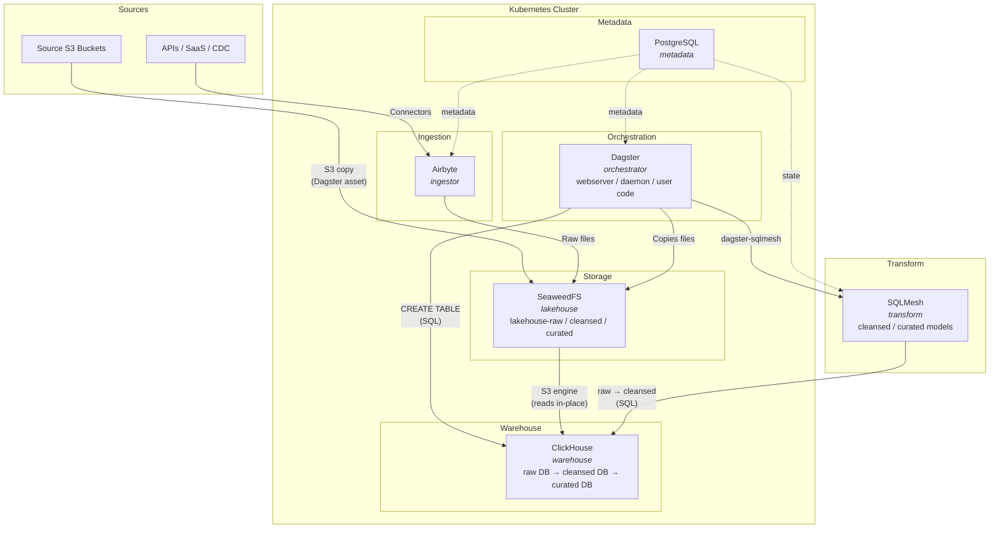

# Open Source Data Platform

> **Work in Progress** — This project is under active development. Ingestion and transformation layers are functional. Scheduling, monitoring, and curated layer capabilities are not yet implemented.

An open-source data platform built entirely on Kubernetes using free and open-source software. Designed for teams that want full ownership of their data stack without vendor lock-in.

## Architecture



### Data Flow

1. **Ingestion** - Two paths based on source type:
   - **File sources (S3)**: Dagster copies files byte-for-byte from source S3 buckets into SeaweedFS `lakehouse-raw` bucket
   - **API/SaaS/CDC sources**: Airbyte connectors handle auth, pagination, rate limiting and land data in the raw layer
2. **Raw table creation** - Dagster creates ClickHouse tables using the S3 engine, pointing directly at raw parquet files in SeaweedFS
3. **Transformation** - SQLMesh models (orchestrated by Dagster via `dagster-sqlmesh`) transform data through `raw` -> `cleansed` -> `curated` databases in ClickHouse

### Lakehouse Layers

| Layer | SeaweedFS Bucket | ClickHouse DB | Purpose |
|-------|-----------------|---------------|---------|
| Raw | `lakehouse-raw` | `raw` | Source files as-is, indefinite retention |
| Cleansed | `lakehouse-cleansed` | `cleansed` | Validated, deduplicated, typed |
| Curated | `lakehouse-curated` | `curated` | Business-ready, aggregated |

## Tech Stack

| Component | Tool | Purpose |
|-----------|------|---------|
| Orchestration | [Dagster](https://dagster.io) | Pipeline scheduling, asset management, observability |
| Transformation | [SQLMesh](https://sqlmesh.com) | SQL-based data transformations with virtual environments |
| Warehouse | [ClickHouse](https://clickhouse.com) | Columnar OLAP database with S3 engine |
| Object Storage | [SeaweedFS](https://github.com/seaweedfs/seaweedfs) | S3-compatible distributed storage (lakehouse) |
| Ingestion | [Airbyte](https://airbyte.com) | Connectors for API/SaaS/CDC sources |
| Metadata DB | [PostgreSQL](https://postgresql.org) | Shared metadata store for Dagster, Airbyte, and SQLMesh |
| Deployment | [Kubernetes](https://kubernetes.io) + [Helm](https://helm.sh) | Container orchestration and declarative deployment |
| Shared Library | Python / [Pydantic](https://docs.pydantic.dev) | Config models, validation, K8s secret loading |

## Project Structure

```
os-data-platform/
├── configuration/                  # User-defined YAML configs (mounted into containers)
│   └── ingestion/
│       └── source1.yml             # Per-source ingestion config
│
├── libs/                           # Shared Python library ("common" package)
│   ├── src/common/
│   │   ├── models/
│   │   │   ├── core.py             # IngestionConfig, LakehouseLayer, CapabilityConfig
│   │   │   └── ingestion.py        # S3-specific models, K8s secret resolution
│   │   └── user_config.py          # Loads YAML configs by capability type
│   ├── tests/
│   └── pyproject.toml
│
├── orchestrator/                   # Dagster user code
│   ├── src/
│   │   ├── definitions.py          # Entry point: builds ingestion + transform assets, registers Definitions
│   │   ├── assets/
│   │   │   ├── ingestion.py        # Abstract builder + factory (dispatches by source_type)
│   │   │   ├── ingestion_s3.py     # S3 ingestion: copy to lakehouse + create raw table
│   │   │   └── transform.py        # SQLMesh integration: dagster-sqlmesh assets with custom translator
│   │   ├── resources/
│   │   │   ├── lakehouse.py        # SeaweedFS S3 client (extends dagster-aws S3Resource)
│   │   │   └── warehouse.py        # ClickHouse client (extends dagster-clickhouse)
│   │   └── sql/
│   │       └── ingestion/
│   │           └── create_raw_table.sql  # Jinja2 template for ClickHouse S3 engine tables
│   ├── docker-compose.yml          # Local dev environment
│   ├── Dockerfile
│   └── pyproject.toml
│
├── transform/                      # SQLMesh project (transformation layer)
│   ├── config.yaml                 # SQLMesh config: ClickHouse connection + Postgres state
│   ├── models/
│   │   └── cleansed/               # Cleansed layer SQL models
│   │       ├── noaa_ghcn_countries.sql
│   │       ├── noaa_ghcn_states.sql
│   │       ├── noaa_ghcn_stations.sql
│   │       └── noaa_ghcn_inventory.sql
│   └── pyproject.toml
│
├── helm/                           # Helm charts and values for K8s deployment
│   ├── metadata/values.yaml        # PostgreSQL (bitnami)
│   ├── storage/                    # SeaweedFS chart wrapper
│   ├── orchestrator/values.yaml    # Dagster (official chart)
│   ├── ingestor/values.yaml        # Airbyte v2 (community)
│   ├── operators/                  # ClickHouse operator
│   ├── warehouse/                  # ClickHouse cluster (custom chart)
│   └── README.md                   # Full deployment runbook
│
├── CLAUDE.md                       # AI assistant context
├── LICENSE                         # GPLv3
└── .gitignore
```

## Quick Start

### Prerequisites

- Python >= 3.12
- Docker + Docker Compose (local dev)
- Kubernetes cluster + Helm (production)

### Local Development

```shell
cd orchestrator

# Start all Dagster services (postgres, user_code, webserver, daemon)
docker-compose up -d

# Dagster UI at http://localhost:3000

# Validate definitions
docker-compose exec user_code dagster definitions validate -m src.definitions

# Materialize a specific asset
docker-compose exec user_code dagster asset materialize --select ingest_source1_table1 -m src.definitions
```

### Kubernetes Deployment

See [helm/README.md](helm/README.md) for the full deployment runbook including secrets setup and install order.

## Configuration

Ingestion sources are defined as YAML files in `configuration/ingestion/`. Each file describes one source:

```yaml
# configuration/ingestion/source1.yml
name: source1
source_type: "s3"
s3_config:
  bucket: my-source-bucket
  k8s_secret: "os-data-platform/my-aws-secret"
  k8s_secret_aws_key: "key"
  k8s_secret_aws_secret: "secret"
  tables:
    - name: table1
      prefix: "source1/table1/**"
      file_format: parquet
```

Dagster auto-discovers these configs at startup and generates assets per table:
- `ingest_{source}_{table}` - copies files from source S3 to SeaweedFS raw bucket
- `raw_{source}_{table}` - creates a ClickHouse table pointing at the raw files via S3 engine
- `cleansed_{source}_{table}` - SQLMesh models that transform raw tables into cleansed tables (auto-discovered from `transform/models/`)

## Design Decisions

### Ingestion Strategy: Airbyte for Connectors, Direct Copy for Files

**Decision:** Use Airbyte for API/SaaS/CDC sources. Use direct S3 copy + ClickHouse S3 engine for file-based sources.

**Context:** Airbyte deserializes all source data into JSON records (Airbyte protocol) then re-serializes to the destination format. There is no passthrough/raw-file mode. For file-based sources this means parquet files get deserialized and re-serialized, which is unnecessary overhead and can introduce schema inference noise or precision loss.

**Rationale:**
- **Raw layer preservation:** The raw layer should keep source files as close to original as possible. Byte-for-byte copy achieves this; Airbyte deserialization works against it.
- **Failure isolation:** If source S3 has short retention (e.g. 3 days), data must land in our raw bucket before any transformation. A direct copy has fewer failure points than Airbyte's deserialize-serialize pipeline.
- **Schema validation at the right layer:** Schema checks are better done as an explicit Dagster asset (controlled, observable) rather than implicitly inside the ingestion tool.
- **Right tool for the job:** Airbyte excels at sources that need connectors, auth, pagination, rate limiting. S3 files are already accessible -- no connector needed.

**Consequences:**
- Two ingestion paths to orchestrate (Dagster handles both).
- Airbyte manages API/SaaS/CDC ingestion.
- Direct S3 copy (via Dagster asset) copies file-based sources to raw bucket.
- ClickHouse reads raw parquet directly via S3 table function / named collection.

### Raw Layer as Safety Net

**Decision:** All ingestion (file-based or connector-based) lands in a raw S3 bucket with indefinite retention before loading to ClickHouse.

**Context:** Source systems may have short data retention. Schema changes or pipeline failures can prevent data from loading into the warehouse. Without a raw layer, data loss is permanent.

**Rationale:**
- Decouples ingestion from transformation -- if ClickHouse load fails, raw data is safe.
- Engineers have time to investigate and fix schema issues without data loss pressure.
- Enables replay and backfill from raw at any time.
- Provides audit trail of what arrived and when.

**Consequences:**
- Additional S3 storage cost (acceptable trade-off for data safety).
- Pipeline pattern: `source -> raw S3 -> validate/transform -> ClickHouse`.

### Config-Driven Asset Generation

**Decision:** Define ingestion sources as YAML files. Dagster generates assets dynamically at startup from these configs.

**Rationale:**
- Adding a new source requires zero Python code -- just a YAML file.
- Builder pattern (`IngestionAssetBuilder`) dispatches to the right implementation by `source_type`.
- Pydantic models validate config structure before any asset runs.
- Credentials are resolved at runtime from K8s secrets, never stored in YAML.

### SeaweedFS over MinIO

**Decision:** Use SeaweedFS as the S3-compatible object store instead of MinIO.

**Rationale:**
- SeaweedFS handles small-to-medium file workloads efficiently with its volume-based architecture.
- Both Dagster and Airbyte connect via standard S3 API -- the backing store is transparent.
- Avoids MinIO licensing concerns for production use.

### ClickHouse S3 Engine for Raw Tables

**Decision:** Raw ClickHouse tables use the S3 engine with named collections to read directly from SeaweedFS.

**Rationale:**
- No data duplication -- ClickHouse reads parquet files in-place from the lakehouse.
- Named collection (`seaweedfs`) centralizes S3 endpoint and credentials as a ClickHouse config.
- Schema changes in source files are handled by recreating the table definition, not re-ingesting data.
- Jinja2 SQL templates (`create_raw_table.sql`) keep table creation DRY and parameterized.

## License

[GPLv3](LICENSE)