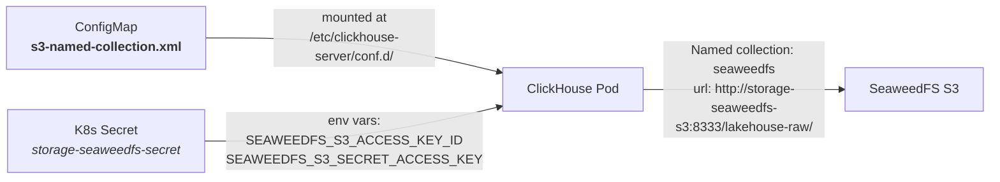

# Warehouse (ClickHouse)

Custom Helm chart deploying a ClickHouse cluster managed by the ClickHouse Operator. Reads raw data directly from SeaweedFS via the S3 engine.

## Components

| Template | Resource | Purpose |
|----------|----------|---------|
| `clickhouse-cluster.yaml` | `ClickHouseCluster` CR | ClickHouse server with S3 named collection mount |
| `keeper-cluster.yaml` | `KeeperCluster` CR | ZooKeeper-compatible coordination service |
| `lakehouse-config.yaml` | `ConfigMap` | S3 named collection XML (`seaweedfs`) |
| `warehouse-init-job.yaml` | `Job` + `ConfigMap` | Helm post-install/upgrade hook to run init SQL |

## How S3 Integration Works



ClickHouse tables use this named collection:
```sql
CREATE TABLE raw.source1_table1
ENGINE = S3(seaweedfs, filename='source1/table1/*.parquet')
```

## Values

```yaml
s3:
  secretName: storage-seaweedfs-secret    # K8s secret with S3 credentials
  host: storage-seaweedfs-s3              # SeaweedFS S3 service name
  port: 8333
  bucket: lakehouse-raw

keeper:
  replicas: 1

clickhouse:
  replicas: 1
  shards: 1
  storage:
    size: 10Gi
  resources:
    requests: { cpu: 250m, memory: 512Mi }
    limits: { cpu: "2", memory: 4Gi }
  initSQL: |                              # Runs via post-install Helm hook
    CREATE DATABASE IF NOT EXISTS raw;
    CREATE DATABASE IF NOT EXISTS cleansed;
    CREATE DATABASE IF NOT EXISTS curated;
```

## Prerequisites

The ClickHouse Operator must be installed before this chart:

```shell
helm install operators ./helm/operators -n os-data-platform
```

## Install

```shell
helm install warehouse ./helm/warehouse -f helm/warehouse/values.yaml -n os-data-platform
```
