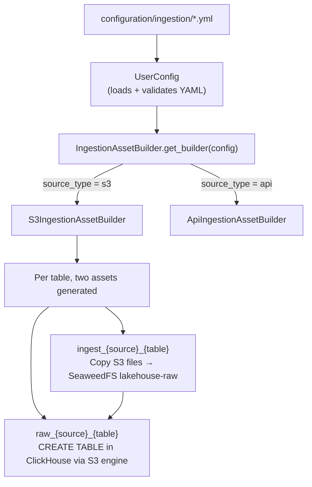

# Orchestrator

Dagster-based orchestration layer. Dynamically generates ingestion assets from YAML configuration files.

## How It Works



### Entry Point

`src/definitions.py` loads `UserConfig` from `./configuration`, iterates over all ingestion configs, builds assets via the builder pattern, and registers them with Dagster along with shared resources (lakehouse + warehouse).

### Assets

Each S3 source table produces two chained assets:

1. **`ingest_{source}_{table}`** - Paginates source S3 bucket, copies every object matching the prefix into SeaweedFS `lakehouse-raw` bucket. Uses boto3 directly for the source, `LakehouseResource` for the destination.

2. **`raw_{source}_{table}`** - Runs a Jinja2-templated SQL statement against ClickHouse to create a table using the S3 engine and the `seaweedfs` named collection, pointing at the raw parquet files.

### Resources

| Resource | Class | Backend |
|----------|-------|---------|
| `lakehouse` | `LakehouseResource` (extends `S3Resource`) | SeaweedFS via boto3 with path-style addressing |
| `warehouse` | `WarehouseResource` (extends `ClickhouseResource`) | ClickHouse via `dagster-clickhouse` |

### SQL Templates

Located in `src/sql/`. Uses Jinja2 for parameterization. Currently:
- `ingestion/create_raw_table.sql` - `CREATE TABLE IF NOT EXISTS raw.{source}_{table} ENGINE = S3(seaweedfs, ...)`

### Credential Handling

Source S3 credentials are resolved at runtime from Kubernetes secrets. The `IngestionS3Config` model (in `src/common/`) reads the K8s secret specified in the YAML config and extracts the access key and secret.

## Project Structure

```
orchestrator/
├── src/
│   ├── definitions.py              # Dagster entry point
│   ├── common/                     # Config models + YAML loader ("common" package)
│   │   ├── models/                 # IngestionConfig, source types, table/partition models
│   │   └── user_config.py          # Loads YAML configs by capability type
│   ├── assets/
│   │   ├── ingestion.py            # IngestionAssetBuilder ABC + factory
│   │   ├── ingestion_s3.py         # S3IngestionAssetBuilder
│   │   └── ingestion_api.py        # ApiIngestionAssetBuilder (dlt REST)
│   ├── resources/
│   │   ├── lakehouse.py            # LakehouseResource (SeaweedFS S3)
│   │   └── warehouse.py            # WarehouseResource (ClickHouse)
│   └── sql/
│       └── ingestion/
│           └── create_raw_table.sql
├── tests/                          # Unit tests (models, config loader, asset builders)
├── docker-compose.yml              # Local dev (postgres + dagster services)
├── dagster.yaml                    # Instance config (postgres storage)
├── workspace.yaml                  # gRPC code server config
├── Dockerfile                      # python:3.12, installs via uv
├── pyproject.toml                  # Deps: dagster, dagster-aws, dagster-clickhouse, dlt, pydantic
├── .env                            # Local env vars
└── .python-version                 # 3.12
```

## Local Development

### Prerequisites

- Docker + Docker Compose
- `OS_DATA_PLATFORM_STORAGE_ROOT_PASSWORD` env var set (SeaweedFS secret)

### Start Services

```shell
# Build image and start all services
docker-compose up -d

# Dagster UI at http://localhost:3000
```

Docker Compose runs four services:
- **postgres** - Dagster metadata storage
- **user_code** - Dagster code server (gRPC on port 3030), mounts `src/` and `../configuration`
- **webserver** - Dagster web UI on port 3000
- **daemon** - Dagster daemon for schedules/sensors

### Build and Push

```shell
docker-compose build
docker push dadutra2/os-data-platform-orchestrator:latest
```

### Validate and Test

```shell
# Validate definitions load correctly
docker-compose exec user_code dagster definitions validate -m src.definitions

# Materialize a specific asset
docker-compose exec user_code dagster asset materialize --select ingest_source1_table1 -m src.definitions
```

## Environment Variables

| Variable | Purpose | Default (local) |
|----------|---------|-----------------|
| `SEAWEEDFS_ENDPOINT_URL` | SeaweedFS S3 endpoint | `http://storage-seaweedfs-s3:8333` |
| `SEAWEEDFS_S3_ACCESS_KEY_ID` | SeaweedFS access key | `admin` |
| `SEAWEEDFS_S3_SECRET_ACCESS_KEY` | SeaweedFS secret key | (injected from shell) |
| `CLICKHOUSE_ENDPOINT_URL` | ClickHouse host | `warehouse-clickhouse-headless` |
| `CLICKHOUSE_PORT` | ClickHouse native port | `9000` |
| `CLICKHOUSE_USER` | ClickHouse user | `default` |
| `CLICKHOUSE_PASSWORD` | ClickHouse password | (empty) |
| `CLICKHOUSE_DATABASE` | ClickHouse default DB | `default` |
| `POSTGRES_USER` | Dagster metadata DB user | `dagster` |
| `POSTGRES_PASSWORD` | Dagster metadata DB password | `dagster` |
| `POSTGRES_DB` | Dagster metadata DB name | `dagster` |

## Dependencies

- `common` - config models + YAML loader, now an in-tree package under `src/common`
- `pydantic`, `pyyaml`, `croniter`, `kubernetes` - config validation + K8s secret resolution
- `dlt[clickhouse]` - API ingestion engine (`api` source type)
- `dagster`, `dagster-webserver`, `dagster-postgres` - core Dagster
- `dagster-aws` - S3Resource base class
- `dagster-clickhouse` - ClickhouseResource base class
- `dagster-k8s` - Kubernetes integration
